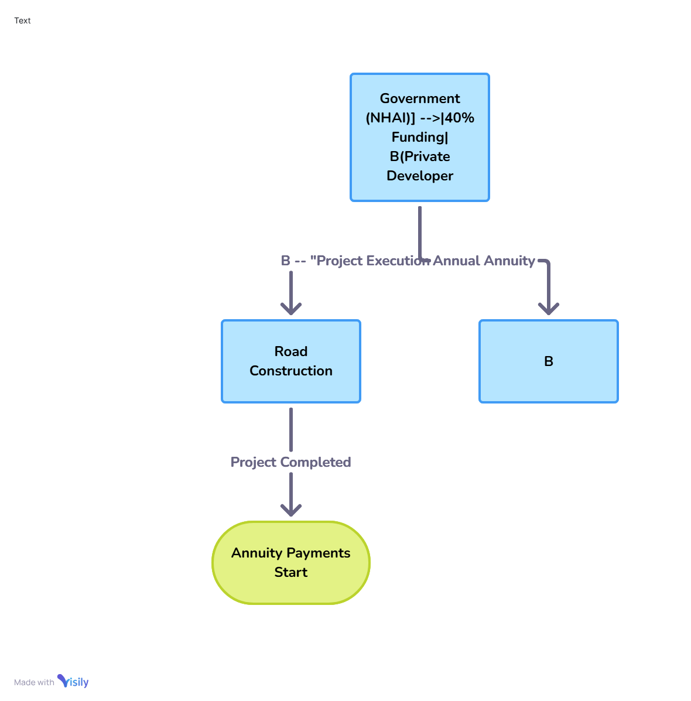

# What is the Hybrid Annuity Model (HAM) in Road Projects

## 1. Introduction

The **Hybrid Annuity Model (HAM)** is a Public-Private Partnership (PPP) model introduced by **NHAI in 2016** to develop road infrastructure. It merges features of **EPC** and **BOT** to balance risk between government and private contractors.

**Why HAM Matters:**
- Eases financial pressure on private players
- Ensures timely road delivery
- Attracts both investors and policymakers

**This Guide is For:**
- Civil engineers  
- Policy planners  
- Contractors & developers  
- Project finance professionals  
- Infrastructure students  

---

## 2. Key Terminology

- **PPP**: Partnership between public and private sectors
- **EPC Model**: Government funds 100%, private party builds only
- **BOT Model**: Private party builds, operates, and collects revenue
- **Hybrid Annuity**: Shared risk model with annuity-based payments
- **Annuity**: Fixed payments at regular intervals
- **NHAI**: National Highways Authority of India
- **VGF**: Government financial support to bridge project viability

---

## 3. Technical Overview

### How HAM Works:
- Govt pays **40% during construction** in 5 milestones  
- Private player funds **60%**, reimbursed over **15 years**  
- Govt pays **interest + O&M costs**  
- Revenue risk stays with government  

### Key Stakeholders:
- **NHAI**: Funding + annuity
- **Developer**: Builds and partially funds
- **Lenders**: Finance developer's share

### Risk Sharing:
- **Construction**: Private
- **Revenue**: Government
- **O&M**: Private

{ width="400px" style="border: 1px solid #ccc; border-radius: 8px;"}

## 4. Step-by-Step Guide

### Project Phases

#### Planning
- Identify the road project  
- Prepare DPR (Detailed Project Report)

#### Bidding & Award
- Invite bids from developers  
- Award project to lowest bidder

#### Financial Closure
- Developer arranges 60% project finance  
- Govt may offer Viability Gap Funding (VGF)

#### Construction
- Govt pays 40% in 5 milestone-based installments

#### Post-Construction
- Public starts using the road  
- Govt pays annuity + O&M over 15 years

---

## 5. Best Practices

### For Government
- Validate milestones on time  
- Ensure annuity funding is available

### For Developers
- Avoid cost overruns  
- Work with reliable financial partners

### For Lenders
- Assess project cash flows  
- Monitor construction progress

### General
- Include risk-sharing in contracts  
- Use proper tools to track execution and O&M

---

## 6. Common Issues & Fixes

| Issue                   | Description                   | Solution                                |
|------------------------|-------------------------------|-----------------------------------------|
| Delayed Payments        | Milestone-based payments slow | Use audit trails and automation         |
| Cost Overruns           | Rising materials/labor costs  | Add buffer funds and escalation clauses |
| Land Acquisition Delays | Land not ready before bidding | Secure land pre-bid                     |
| Financing Gaps          | Developer lacks capital       | Govt help via VGF or guarantees         |

---

## 7. References

- [NHAI Official Website](https://nhai.gov.in)  
- [Ministry of Road Transport & Highways](https://morth.nic.in/)   
- World Bank Reports on PPP Models  
- Economic Survey Reports (India)

---

## 8. Appendix

### Sample Cost Structure

| Component               | Amount        |
|------------------------|---------------|
| Government Grant       | 40%           |
| Developer Equity/Debt  | 60%           |
| Annuity Duration       | 15 years      |
| O&M                    | Paid by Govt  |

### Sample Contract Milestones

- Land acquisition complete  
- Mobilization completed  
- 25% construction done  
- 50% construction done  
- Project completion  
